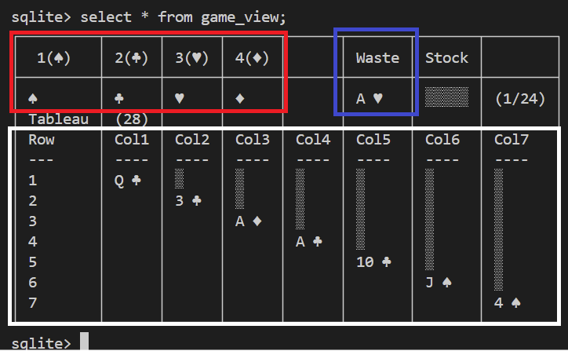

# solitaire-sqlite

[](https://creativecommons.org/licenses/by-nc/4.0/)
[](http://makeapullrequest.com)

## The Project

This project is a SQLite implementation of the Solitaire (Klondike) card game. It includes the necessary files to set up the database, a sample database, an easy game for demonstration, and AutoHotkey scripts to facilitate gameplay.

SQLite was chosen, as JFK would said `Not because it was easy, but because it was hard`. This is my moon landing.

- Provide an educational tool for SQL learners
- Demonstrate advanced SQLite features
- Explore game logic purely through database operations
- Challenge myself to build a complete game without traditional programming languages

### How Constraints Shaped Design
| Limitation          | Creative Solution               |
|---------------------|---------------------------------|
| No procedures       | Triggers as game rules          |
| No CTEs in triggers | `sqlite_master` as row generator|
| No variables        | Whole-table state updates       |

### Why It Matters
- Proves that even "limited" tools can build complex systems
- Shows how constraints breed creativity
- Demonstrates SQLite's real power: *triggers as game engine*, *views as UI renderers*

### Educational Value
Learn advanced SQL through:
- Trigger-driven state machines
- View-based game state representation
- Virtual columns for derived game rules


## Directory Structure

```text
solitaire-sqlite
├── src
│   ├── db
│   │   ├── 1.schema.sql      # SQL commands to create tables and indexes
│   │   ├── 2.views.sql       # SQL commands to create views
│   │   └── 3.triggers.sql    # SQL commands to create triggers
│   ├── tests
│   |   └── test_game.sql     # A complete game that must result in Victory
│   └── scripts/
│       └── solitaire.ahk     # AHK to facilitate writing moves
├── install
│   └── install.sql           # Initial migration script for setting up the database
├── example
│   └── game.db               # Example database with a game in progress
├── how_to_play.md            # Game instructions
├── CHANGELOG.md
├── COPYING
├── LICENSE                   # Licensing information for the project
└── README.md                 # Documentation for the project
```

## Requirements

The project requires SQLite and optionally AutoHotKey (Windows only)

## Installation

If you already has SQLite, run

CMD
``` bash
   sqlite3 Solitaire.db < src/install/install.sql
```

PowerShell
``` powershell
sqlite3 Solitaire.db ".read src/install/install.sql"
```

### SQLite

You don't need to install SQLite locally to run the game. There are several websites like [SQLiteOnLine](https://sqliteonline.com) where you can run the scripts online.
If you want to run it on your computer, first check if it's already installed by opening your terminal/prompt:

```bash
sqlite3 --version
```

### SQLite Installation on Linux and macOS

In the terminal, type the appropriate command for your system:

```bash
sudo apt install sqlite3  # Debian/Ubuntu  
sudo dnf install sqlite   # Fedora  
sudo pacman -S sqlite     # Arch Linux  
brew install sqlite       # MacOS using HomeBrew
```

For MacOS users who don't have Homebrew installed:

```bash
/bin/bash -c "$(curl -fsSL https://raw.githubusercontent.com/Homebrew/install/HEAD/install.sh)"
```

### SQLite Installation on Windows

In the command prompt:

```cmd
winget install sqlite
```

Alternatively - you can go the hard way - you can download from the [SQLite official website](https://sqlite.org/download.html). Look for `sqlite-tools-win-x64-nnnnnnn.zip`.

To add SQLite to your PATH:

1. Press Win+R, type:

```cmd
rundll32.exe sysdm.cpl,EditEnvironmentVariables
```

2. Press ***Ctrl+Shift+Enter*** to open as administrator

3. Under System Variables, click New

4. Set variable name as "SQLite"

5. Set variable value as the installation folder path

6. Click OK

Verify the installation:
```cmd
sqlite3 --version
```

### AutoHotkey (Windows Only, Optional)

1. Install via command prompt:

```cmd
winget install AutoHotkey
```

Or download from [AutoHotkey's website](https://www.autohotkey.com/)

- V2 doesn't require installation

2. To run the script:

   - If installed: Double-click `scripts/solitaire.ahk`
   - If not installed: Copy `Autohotkey64.exe` to project folder and drag `scripts/solitaire.ahk` onto it

## Game Installation

1. **Clone Repository**

```bash
git clone https://github.com/leandrolopesp/solitaire-sqlite
cd solitaire-sqlite
```

2. **Database Setup**

Assuming you name your database "Solitaire.db":

- Open terminal in project folder and type `sqlite3 Solitaire.db`

- To run all commands automatically:

```shell
.read src/install/install.sql
```
 
Or run individually:

```shell
.read src/db/1.schema.sql
.read src/db/2.views.sql
.read src/db/3.triggers.sql
```

## Playing the Game

- To start a new game: `insert into moves(action) values('new');` (or type "nw" with AutoHotkey)
- To view the game board: `select * from game_view;`
- Choose your preferred display mode:

```shell
.mode box
.mode column
.mode table
.mode tab
.mode markdown
```

You should see a screen like below:  



- The red section is your foundation
- The blue section shows the card in your waste pile
- The white section is the tableau
- For gameplay instructions, read `how_to_play.md`
- There is a full game for tests at `tests/test_game.sql`

## License

[![CC BY-NC 4.0][cc-by-nc-shield]][cc-by-nc]

This work is licensed under a
[Creative Commons Attribution-NonCommercial 4.0 International License][cc-by-nc].

[![CC BY-NC 4.0][cc-by-nc-image]][cc-by-nc]

[cc-by-nc]: http://creativecommons.org/licenses/by-nc/4.0/
[cc-by-nc-image]: https://licensebuttons.net/l/by-nc/4.0/88x31.png
[cc-by-nc-shield]: https://img.shields.io/badge/License-CC%20BY--NC%204.0-lightgrey.svg

You are free to:
- Share — copy and redistribute the material in any medium or format
- Adapt — remix, transform, and build upon the material

Under the following terms:
- **Attribution** — You must give appropriate credit, provide a link to the license, and indicate if changes were made.
- **NonCommercial** — You may not use the material for commercial purposes.