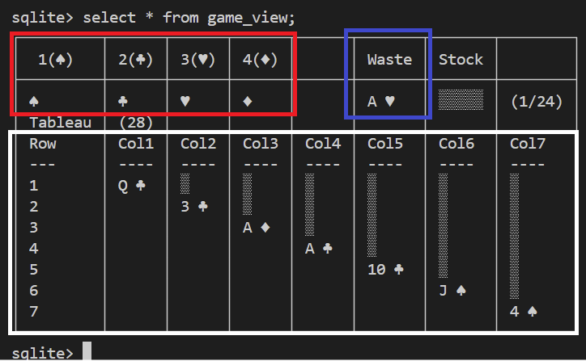

# Klondike SQLite - The Game

The game is played by querying the `game_view` to display the board.
Since SQLite doesn't support stored procedures, all moves are made through inserts into the `moves` table. This triggers the game rules.

## "Graphical" Interface

You should see a screen like below:  


- The red section is your ***foundation***
- The blue section shows the card in your ***waste pile***
- The white section is the ***tableau***

## General Rules

1. The goal is to move all cards to the ***foundations***, organized by suit in ascending order (A to K)
2. On the ***tableau***, cards are arranged in descending order (K to A) alternating colors (red/black)
3. Only Kings (K) can occupy empty spaces on the tableau
4. Face-down cards are revealed when the card above them is moved

## Possible Moves

### Tableau Moves

- Move one or more cards between tableau columns, following descending order and alternating colors
- Move a King (K) to an empty space

### Stock Pile/Waste Moves

- Turn over a card from the stock pile to the waste pile
- When the stock pile is empty, all cards from the waste pile return to the stock pile in the same order

### Foundation Moves

- Move cards to the foundation in ascending order, starting with Ace (A)
- Cards in the foundation must be of the same suit
- You can move a card back from the foundation to the tableau if needed

## Victory Condition

The game is won when all 52 cards are in the foundations, organized by suit in ascending order (A to K)

# SQL Commands

To play, you need to execute SQL commands by inserting records into the `moves` table.
If you're using Windows and have AutoHotkey running `src\scripts\solitaire.ahk`, the hotstrings are listed below after ::.

Available commands:

## Game Controls

```sql
-- Start new game ::nw
INSERT INTO moves(action) VALUES('new');

-- Reset current game ::rs
INSERT INTO moves(action) VALUES('reset');
```

## Stock Pile/Waste Moves

```sql
-- Turn next card from stock pile ::dd
INSERT INTO Moves (action) VALUES('deal');

-- Move card from waste (source not informed) to tableau ::wt  
INSERT INTO moves(target) 
VALUES([target_column]);
```

## Tableau Moves

```sql
-- Move card(s) between tableau columns ::mv
INSERT INTO moves(action, source, target) 
VALUES('move', [source_column], [target_column]);
```

## Foundation Moves

```sql
-- Move waste card (source not informed) to foundation ::wf 
INSERT INTO moves(action) 
VALUES('to-foundation');

-- Move tableau card to foundation ::tf
INSERT INTO moves(action, source) 
VALUES('to-foundation', [source_column]);

-- Return card from foundation to tableau ::ft
INSERT INTO moves(action, source, target) 
VALUES('from-foundation', [foundation_source], [target_column]);
```

> Note: Columns are numbered 1 to 7 from left to right.
> Foundations are numbered 1 to 4 in the order ♠,♣,♥,♦.

## AutoHotkey

To make moves easier, the `src\scripts\solitaire.ahk` file provides shortcuts that automatically generate SQL commands.

### Hotstrings

Type the codes below followed by space or Enter:

| Code | Action | Generated Command |
|------|--------|-------------------|
| `nw` | New game | `INSERT INTO moves(action) VALUES('new');` |
| `rs` | Reset game | `INSERT INTO moves(action) VALUES('reset');` |
| `..` | Shows game | `SELECT * FROM game_view;` |
| `dd` | Turn stock pile card | `INSERT INTO Moves (action) VALUES('deal');` |
| `cc` | Clear current line | _Erases the command being edited_ |
| `aa` | Move "all" possible | _Tries to move cards from columns 1-4 to foundation_ |
| `wf` | Waste -> Foundation | `INSERT INTO moves(action) VALUES('to-foundation');` |
| `wt` | Waste -> Tableau | `INSERT INTO moves(target) VALUES(` |
| `mv` or `tt`  | Move between columns (Tableau -> Tableau) | `INSERT INTO moves(action, source, target) VALUES('move', ` |
| `tf` | Tableau -> Foundation  | `INSERT INTO moves(action, source) VALUES('to-foundation', ` |
| `ft` | Foundation -> Tableau | `INSERT INTO moves(action, source, target) VALUES('from-foundation', ` |

> Note: After some commands (like `wt`, `tf`, etc.), the cursor will be positioned for you to edit the parameter before executing.

Special Hotstrigs

| Code | Action | Generated Command |
|------|--------|-------------------|
| `wt1` to `wt7` | Waste -> Tableau Y | `INSERT INTO moves(target) VALUES(`**Y**`);` |
| `tf1` to `tf7`  | Tableau X -> Foundation  | `INSERT INTO moves(action, source) VALUES('to-foundation',`**X**`);` |
| `mv`**XY** or `tt`**XY**  | Move between columns (Tableau X -> Tableau Y) | `INSERT INTO moves(action, source, target) VALUES('move',`**X**`,`**Y**`);` |
| `ft`**XY** | Foundation X -> Tableau Y | `INSERT INTO moves(action, source, target) VALUES('from-foundation', `**X**`,`**Y**`);` |


### Hotkeys

- `Esc` - Terminates the AutoHotkey script